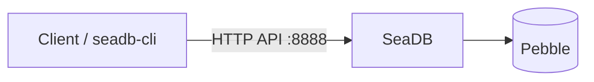

# Overview

SeaDB supports two deployment modes:

- **Single-node mode**, which uses **Pebble** as the embedded key-value store.
- **Cluster mode**, which uses **[FoundationDB](https://apple.github.io/foundationdb/)** as an external distributed key-value store.

For most deployments, start with single-node mode. It has fewer external dependencies and is the simplest way to deploy and operate SeaDB. Cluster mode is intended for environments that require multiple SeaDB nodes and horizontal scalability.

## Choose a deployment mode

| Deployment mode | Storage backend | Additional cluster components | Recommended for |
| --- | --- | --- | --- |
| Single node | Embedded Pebble | None | Evaluation, development, and most standard deployments |
| Cluster | FoundationDB | etcd, SeaDB-Proxy, and Cluster-Manager | Multi-node and horizontally scalable deployments |

!!! tip "Start with single-node mode unless you need a cluster"
    Single-node mode is the recommended starting point for most users. You can deploy one SeaDB service with persistent local storage and access the REST API directly on port `8888`.

## Single-node deployment

In single-node mode, SeaDB runs as one service and stores data in the embedded Pebble backend. No separate FoundationDB or cluster coordination service is required.

The Docker deployment guide uses:

- `/opt/seadb` for the Docker Compose files.
- `/opt/seadb-data` for persistent SeaDB data.
- TCP port `8888` for the SeaDB HTTP API.

Follow [Setup SeaDB](seadb_setup_single_node.md) for the complete single-node deployment procedure, including administrator initialization and post-deployment verification.

## Cluster deployment

In cluster mode, SeaDB uses FoundationDB as its storage backend. SeaDB nodes are coordinated with etcd, clients connect through SeaDB-Proxy, and Cluster-Manager manages cluster node information.

Deploy the required backend services before deploying the SeaDB cluster:

1. Set up the [FoundationDB cluster](foundationdb_cluster.md).
2. Set up etcd.
3. Deploy the [SeaDB cluster](seadb_cluster_native.md).

Cluster deployment has more infrastructure dependencies and operational requirements than single-node mode. If you do not specifically need multiple SeaDB nodes, use the single-node deployment.
