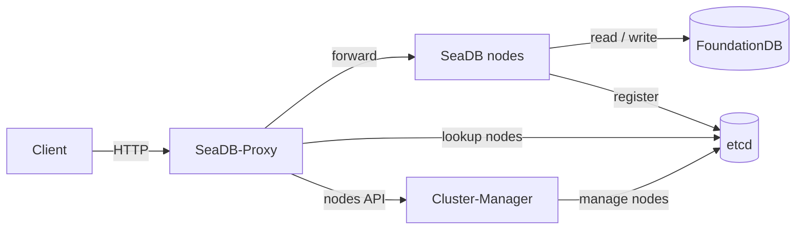

# SeaDB cluster

A SeaDB cluster consists of multiple SeaDB processes, multiple SeaDB-Proxy processes (referred to as *Proxy* below), and one Cluster-Manager process (referred to as *Manager* below). The external components are an [etcd](https://etcd.io/) cluster and FoundationDB.



## Preparation

- Set up an etcd cluster and a FoundationDB cluster before deploying.
- Deploy SeaDB nodes on separate servers for fault isolation in production.
- Place Proxy processes close to their clients to reduce network latency.
- The Manager process can be deployed on any server.

## Setup

### 1. Configure and start all SeaDB processes

Example configuration:

```env
# Node-local paths may differ between servers
SEADB_LOG_DIR="./log"
SEADB_DATA_DIR="./data"
SEADB_STORAGE_BACKEND="fdb"
SEADB_FDB_CLUSTER_FILE="/etc/foundationdb/fdb.cluster"
JWT_PRIVATE_KEY="<at-least-32-random-characters>"

# The following settings are required in cluster mode
SEADB_CLUSTER_ENABLE="true"
SEADB_CLUSTER_NODE_ID="1"           # each node must use a different ID
SEADB_CLUSTER_ETCD_ENDPOINTS="etcd-01:2379,etcd-02:2379,etcd-03:2379"
```

Use the same `JWT_PRIVATE_KEY`, FoundationDB cluster, and etcd prefix on every
SeaDB node. Node-local paths may differ. Keep `SEADB_CLUSTER_NODE_ID` unique
and stable for each node.

### 2. Configure and start the Manager process

Example configuration:

```env
SEADB_LOG_DIR="./log"
SEADB_ETCD_ENDPOINTS="etcd-01:2379,etcd-02:2379,etcd-03:2379"
```

### 3. Register the node information

Send a request to the Manager to register the addresses of all SeaDB nodes:

```shell
curl -fsS -X POST http://cluster-manager:8890/api/cluster/nodes \
  -H 'Content-Type: application/json' \
  --data-raw '{
    "nodes": [
        {"id": 1, "url": "http://sea-db-01:8888/"},
        {"id": 2, "url": "http://sea-db-02:8888/"}
    ]
}'
```

### 4. Configure and start the Proxy processes

Example configuration:

```env
SEADB_LOG_DIR="./log"
SEADB_ETCD_ENDPOINTS="etcd-01:2379,etcd-02:2379,etcd-03:2379"
SEADB_CLUSTER_MANAGER_URL="http://cluster-manager:8890"
```

### 5. Configure the clients

Clients must connect to SeaDB through a Proxy.

Verify each Proxy before configuring clients:

```shell
curl -fsS http://proxy-host:8888/ping
```

The expected response is `{"ret":"pong"}`.

## Cluster configuration options

The examples below show the cluster-specific environment variables. See [Cluster env](../configuration/cluster_environment_variables.md) for the complete cluster reference and [Environment variables](../configuration/environment_variables.md) for general SeaDB variables.

### SeaDB

```env
# Set to true in cluster mode
SEADB_CLUSTER_ENABLE=

# The ID of each node
SEADB_CLUSTER_NODE_ID=

# etcd server addresses, comma-separated
SEADB_CLUSTER_ETCD_ENDPOINTS=
SEADB_CLUSTER_ETCD_PREFIX="/seadb"
```

### Manager

```env
# Listening IP and port
SEADB_CLUSTER_MANAGER_HOST="0.0.0.0"
SEADB_CLUSTER_MANAGER_PORT="8890"

# Log directory and level
SEADB_LOG_DIR=
SEADB_CLUSTER_MANAGER_LOG_LEVEL="info"

# etcd server addresses, comma-separated
SEADB_ETCD_ENDPOINTS=
SEADB_ETCD_PREFIX="/seadb"
```

### Proxy

```env
# Listening IP and port
SEADB_PROXY_HOST="0.0.0.0"
SEADB_PROXY_PORT="8888"

# Log directory and level
SEADB_LOG_DIR=
SEADB_PROXY_LOG_LEVEL="info"

# etcd server addresses, comma-separated
SEADB_ETCD_ENDPOINTS=
SEADB_ETCD_PREFIX="/seadb"

# The URL of the Manager server
SEADB_CLUSTER_MANAGER_URL=
```

## Cluster API

The Manager provides the following API to manage cluster node information.

### `GET /api/cluster/nodes`

List the registered cluster nodes.

```text
# sample response
{
    "nodes": [
        {"id": 1, "url": "http://10.0.0.1:8888/"},
        {"id": 2, "url": "http://10.0.0.2:8888/"}
    ]
}
```

### `POST /api/cluster/nodes`

Register nodes.

```text
# sample request
{
    "nodes": [
        {"id": 1, "url": "http://10.0.0.1:8888/"},
        {"id": 2, "url": "http://10.0.0.2:8888/"}
    ]
}
```

### `PUT /api/cluster/nodes`

Update registered node information.

```text
# sample request
{
    "nodes": [
        {"id": 1, "url": "http://10.0.0.3:8888/"}
    ]
}
```

### `DELETE /api/cluster/nodes`

Remove registered nodes.

```text
# sample request
{
    "node_ids": [1]
}
```
