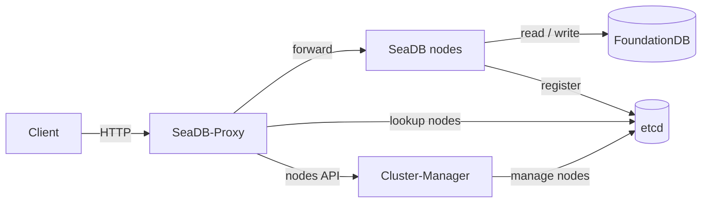

# SeaDB cluster (etcd)

A SeaDB cluster consists of multiple SeaDB processes, multiple SeaDB-Proxy processes (referred to as *Proxy* below), and one Cluster-Manager process (referred to as *Manager* below). The external components are an [etcd](https://etcd.io/) cluster and FoundationDB.



## Preparation

- Set up an etcd cluster and a FoundationDB cluster before deploying.
- SeaDB processes must be deployed on different servers.
- Proxy processes should be deployed on the same servers as the clients.
- The Manager process can be deployed on any server.

## Setup

### 1. Configure and start all SeaDB processes

Example configuration:

```env
# Non-cluster-related settings must be identical across nodes
SEADB_LOG_DIR=
SEADB_DATA_DIR="./data"
JWT_PRIVATE_KEY="private_key"

# The following settings are required in cluster mode
SEADB_CLUSTER_ENABLE="true"
SEADB_CLUSTER_NODE_ID="1"           # each node must use a different ID
SEADB_CLUSTER_ETCD_ENDPOINTS="127.0.0.1:2379"
```

### 2. Configure and start the Manager process

Example configuration:

```env
SEADB_CLUSTER_MANAGER_LOG_DIR="./log"
SEADB_ETCD_ENDPOINTS="127.0.0.1:2379"
```

### 3. Register the node information

Send a request to the Manager to register the addresses of all SeaDB nodes:

```shell
curl -X POST http://cluster-manager/api/cluster/nodes --data-raw '{
    "nodes": [
        {"id": 1, "url": "http://sea-db-01/"},
        {"id": 2, "url": "http://sea-db-02/"}
    ]
}'
```

### 4. Configure and start the Proxy processes

Example configuration:

```env
SEADB_PROXY_LOG_DIR=
SEADB_ETCD_ENDPOINTS="127.0.0.1:2379"
SEADB_CLUSTER_MANAGER_URL="http://cluster-manager"
```

### 5. Configure the clients

Clients must connect to SeaDB through a Proxy.

## Cluster configuration options

All configuration options are passed through environment variables. The values shown below are the defaults. See [Environment variables](../configuration/environment_variables.md) for the complete reference.

### SeaDB

```env
# Set to true in cluster mode
SEADB_CLUSTER_ENABLE=

# The ID of each node
SEADB_CLUSTER_NODE_ID=

# etcd server addresses, comma-separated
SEADB_CLUSTER_ETCD_ENDPOINTS=
SEADB_CLUSTER_ETCD_PREFIX="/seadb"
```

### Manager

```env
# Listening IP and port
SEADB_CLUSTER_MANAGER_HOST="0.0.0.0"
SEADB_CLUSTER_MANAGER_PORT="8890"

# Log directory and level
SEADB_LOG_DIR=
SEADB_CLUSTER_MANAGER_LOG_LEVEL="info"

# etcd server addresses, comma-separated
SEADB_ETCD_ENDPOINTS=
SEADB_ETCD_PREFIX="/seadb"
```

### Proxy

```env
# Listening IP and port
SEADB_PROXY_HOST="0.0.0.0"
SEADB_PROXY_PORT="8888"

# Log directory and level
SEADB_LOG_DIR=
SEADB_PROXY_LOG_LEVEL="info"

# etcd server addresses, comma-separated
SEADB_ETCD_ENDPOINTS=
SEADB_ETCD_PREFIX="/seadb"

# The URL of the Manager server
SEADB_CLUSTER_MANAGER_URL=
```

## Cluster API

The Manager provides the following API to manage cluster node information.

### `GET /api/cluster/nodes`

Get the cluster node information.

```text
# sample response
{
    "nodes": [
        {"id": 1, "url": "http://10.0.0.1:8888/"},
        {"id": 2, "url": "http://10.0.0.2:8888/"}
    ]
}
```

### `POST /api/cluster/nodes`

Add nodes.

```text
# sample request
{
    "nodes": [
        {"id": 1, "url": "http://10.0.0.1:8888/"},
        {"id": 2, "url": "http://10.0.0.2:8888/"}
    ]
}
```

### `PUT /api/cluster/nodes`

Update node information.

```text
# sample request
{
    "nodes": [
        {"id": 1, "url": "http://10.0.0.3:8888/"}
    ]
}
```

### `DELETE /api/cluster/nodes`

Delete nodes.

```text
# sample request
{
    "node_ids": [1]
}
```
